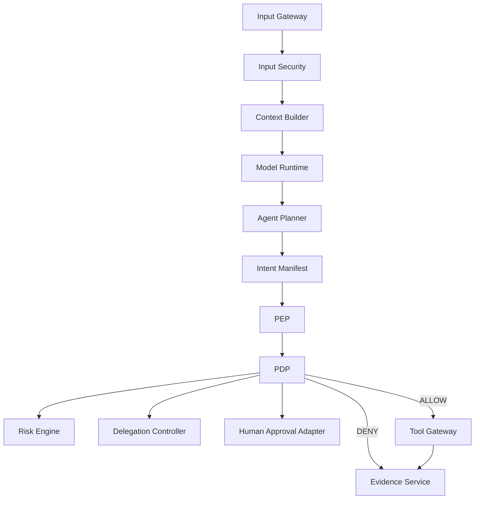

# C4 L3 — Agent Runtime Components

```mermaid
flowchart TB
  I[Input Gateway] --> S[Input Security]
  S --> C[Context Builder]
  C --> M[Model Runtime]
  M --> A[Agent Planner]
  A --> INT[Intent Manifest]
  INT --> PEP[PEP]
  PEP --> PDP[PDP]
  PDP --> R[Risk Engine]
  PDP --> D[Delegation Controller]
  PDP --> H[Human Approval Adapter]
  PDP -->|ALLOW| T[Tool Gateway]
  PDP -->|DENY| E[Evidence Service]
  T --> E
```

## Regra
O Agent Planner não recebe acesso direto a tools críticas. Toda chamada deve passar por interposição de segurança.
