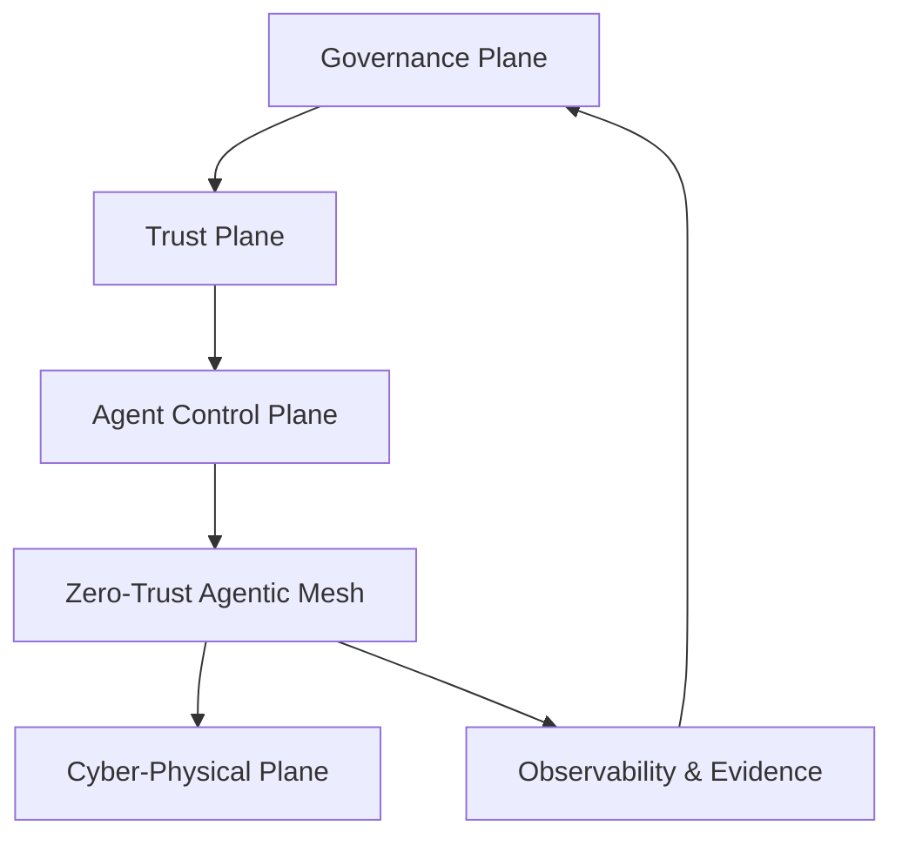

# C4 L2 — Containers / Planes

## Governance Plane
AIMS/GRC, risk appetite, policies, compliance, audit.

## Trust Plane
NHI, workload identity, attestation, PKI, secrets.

## Agent Control Plane
Agent/Model/Tool Registries, PDP, Risk Engine, Delegation Controller, Kill Switch.

## Execution Plane
Cloud/MEC/Edge/device agents e suas tools.

## Observability Plane
Logs, traces, policy decisions, evidence e incident telemetry.
