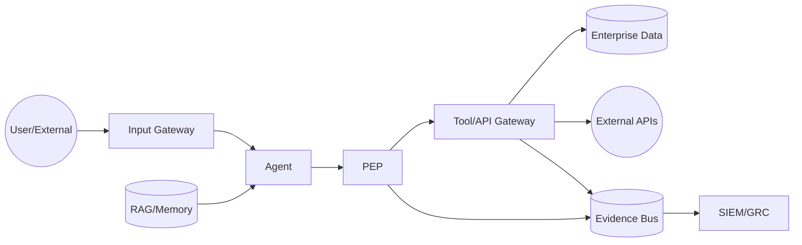

# DFD e Data Flows

## Trust boundaries
- TB-01 Human/External → Input Gateway
- TB-02 Input Gateway → Agent Runtime
- TB-03 Agent → Model
- TB-04 Agent → RAG/Memory
- TB-05 Agent → PEP
- TB-06 PEP → Tool Gateway
- TB-07 Tool Gateway → Enterprise Data
- TB-08 Tool Gateway → External Provider
- TB-09 IT → OT
- TB-10 Digital → Physical

Cada boundary deve ter AuthN/AuthZ, classificação de dados, integridade, telemetry e threat model conforme criticidade.
