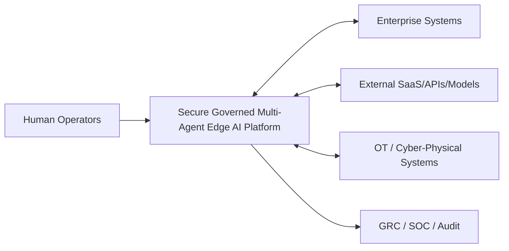

# C4 L1 — System Context

## Actors
- Human Operators / Approvers
- Agent Owners
- GRC / SOC
- Enterprise applications
- External providers
- Cyber-physical systems

## Security objective
Toda transição externa é uma trust boundary. Nenhuma comunicação recebe confiança implícita pela localização.
