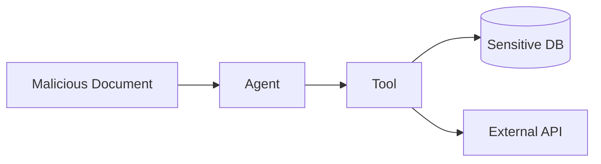

# Attack Path Catalogue

## AP-001 — Indirect Prompt Injection to Exfiltration

Mitigações: input provenance, PEP, tool allow-list, egress deny, capability scoping, evidence.

## AP-002 — Delegation Escalation
`Agent A → Agent B → Agent C → privileged tool`.

Invariante: capabilities efetivas do descendente devem ser subconjunto do envelope delegado.

## AP-003 — Sensor Manipulation to Unsafe Action
`Sensor → Edge Agent → actuation intent → safety barrier → actuator`.

O safety barrier deve ser determinístico/independente do LLM e capaz de negar a ação.

## AP-004 — Semantic Replacement Drift

`Approved Integration Port → API-compatible replacement → weaker failure/revocation semantics → governance bypass`.

Example:

```text
IP-PDP
  ↓
replacement adapter
  ↓
PDP dependency timeout
  ↓
FAIL OPEN   ← forbidden semantic drift
  ↓
critical action executes
```

Mitigations: versioned AdapterProfile, shared conformance harness, outage/partition tests, evidence attribution, measured revocation and explicit residual-risk acceptance.
